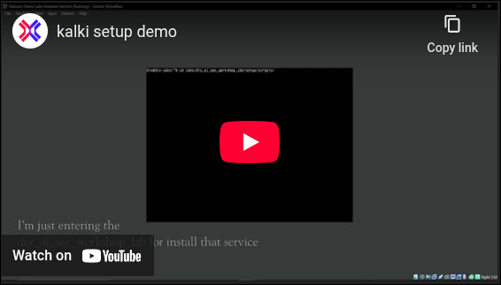

# Introduction

Welcome! 🎉
This guide sets up the **DTX demo lab** using a **Simple Plug and Play VM** (no Terraform, no cloud). You’ll get Docker, uv/Python, Node (via asdf), Go + AppSec tools, Ollama, NGINX, and the Detox labs cloned and ready. 

> Legal note: several tools are offensive-security utilities. Use only on systems you own or have explicit permission to test.

---
## 📂 Virtual Machine Details
- Pre-configured with all required tools  
- Services auto-start: **Nginx, Ollama**  
- Security & AI tooling ready to use out-of-the-box  

---

## 🔑 Credentials
- **User:** `dtx`  
- **Password:** `dtx`  

# Prerequisites

* **OS:** Ubuntu Server 22.04 or 24.04 (x86\_64)
* **Hardware (minimum):** **16 GB RAM**, **250+ GB disk**, **4+ vCPU**
* **Tool:** `VirtualBox`
* **Image:** [Kalki.ova](https://huggingface.co/datasets/detoxioai/dtx-ai-sec-lab/blob/main/kalki.ova)

---


# Steps to Setup Labs:

[](https://www.youtube.com/watch?v=rKCMBK2kqGM)

- Install Oracle Virtualbox
- Download the [Kalki.ova](https://huggingface.co/datasets/detoxioai/dtx-ai-sec-lab/blob/main/kalki.ova)
- Open the ```Kalki.ova``` with Oracle VirtualBox ( It will started to import the labs )
- Once Import is done, Set the configuration by press the setting
- - **RAM:** 16GB RAM ( Min 8GB of RAM recommended ) 
- - **HDD:** 250GB HDD ( Min 50GB of HDD recommended )
- - **CPU :** 8 Core 
- Then Start the machine 
- Enter the Username & Password: ``` dtx : dtx ```
- Paste API keys in .secret Directory
``` bash
 mkdir -p ~/.secrets/
 echo '< OPENAI_API_KEY >' > ~/.secrets/OPENAI_API_KEY.txt
 echo '< GROQ_API_KEY >' > ~/.secrets/GROQ_API_KEY.txt
```
- Run the Tool_setup.sh file 
``` bash
sudo ./Tool_Setup.sh 
```

## Additional Configs 
- Create SSH key using 
``` bash
ssh-keygen -t ed25519 -C "your_email@example.com"
```
- and paste the id_ed25519.pub in the ```~/.ssh/authorized_keys``` 
- Now you can access the machine using your hostmachine terminal without password 
``` bash
ssh dtx@< machine ip >
```

# **Frequently Asked Questions (FAQ) for VirtualBox Errors**

This guide provides solutions to common errors encountered when setting up virtual machines in Oracle VirtualBox, particularly on a Linux host system.

Of course. Here is the extended FAQ guide, incorporating the common USB permissions error and the OVA import issue you mentioned, while maintaining the clear, solution-oriented format of the original text.

-----

### Frequently Asked Questions (FAQ) for VirtualBox Errors

This guide provides solutions to common errors encountered when setting up and managing virtual machines in Oracle VirtualBox, particularly on a Linux host system.

#### 1\. Network Adapter Not Found Error

  * **Q: Why does VirtualBox show the error "Could not start the machine... because the following physical network interfaces were not found"?**
  * **Symptom:** You try to start your VM and receive an error message listing a specific network card that was not found, such as "MediaTek Wi-Fi 6 MT7921 Wireless LAN Card".
  * **Cause:** This happens because your VM's network settings are configured in **"Bridged Adapter"** mode and are tied to a *specific* physical network card on your computer. VirtualBox cannot start the VM because it can't find or access that exact card. This could be because your Wi-Fi is off, you've moved the VM to a new computer, or the card's name has changed.
  * **Solution (Recommended): Switch to NAT**
    This is the easiest fix and works for most use cases, allowing your VM to access the internet.
    1.  Select your VM in the VirtualBox main window and click **Settings**.
    2.  Go to the **Network** tab.
    3.  In the **"Adapter 1"** tab, find the **"Attached to:"** dropdown menu.
    4.  Change the selection from "Bridged Adapter" to **"NAT"**.
    5.  Click **OK** and start your VM.
  * **Solution (Alternative): Re-select the Bridged Adapter**
    Use this option only if you specifically need your VM to appear as a separate device on your local network.
    1.  Go to **Settings \> Network \> Adapter 1**.
    2.  Ensure **"Attached to:"** is set to "Bridged Adapter".
    3.  In the **"Name:"** dropdown menu below it, select a **currently active** network connection from the list (e.g., your Ethernet port or a different Wi-Fi adapter).
    4.  Click **OK** and start your VM.

#### 2\. KVM / AMD-V Virtualization Conflict

  * **Q: How do I fix the error "VirtualBox can't enable the AMD-V extension. Please disable the KVM kernel extension... (VERR\_SVM\_IN\_USE)"?**
  * **Symptom:** Your VM fails to start, and the error message mentions **AMD-V** (for AMD CPUs) or **VT-x** (for Intel CPUs) and complains that it is already in use (`VERR_SVM_IN_USE`). It specifically mentions disabling **KVM**.
  * **Cause:** Your computer's CPU has hardware virtualization features that allow VMs to run efficiently. However, only **one program** (a hypervisor) can use these features at a time. On Linux, the built-in hypervisor is called **KVM** (Kernel-based Virtual Machine). This error means KVM is currently active, preventing VirtualBox from accessing the CPU's virtualization features.
  * **Solution (Temporary Fix): Unload the KVM Module**
    This is the best option if you switch between VirtualBox and other virtualization tools (like QEMU/GNOME Boxes). This command is temporary and will reset upon reboot.
    1.  Open a Terminal on your host Linux machine.
    2.  Run the following commands to unload the KVM modules:
        ```bash
        # For AMD Processors
        sudo modprobe -r kvm_amd
        sudo modprobe -r kvm

        # For Intel Processors
        # sudo modprobe -r kvm_intel
        # sudo modprobe -r kvm
        ```
    3.  Try starting your VirtualBox VM again. It should now work.
  * **Solution (Permanent Fix): Blacklist the KVM Module**
    Use this option only if you plan to use VirtualBox exclusively for virtualization.
    1.  Open a Terminal and create a new configuration file with a text editor:
        ```bash
        sudo nano /etc/modprobe.d/blacklist-kvm.conf
        ```
    2.  Add the following lines to the file (use `kvm_amd` for an AMD system):
        ```
        blacklist kvm_amd
        blacklist kvm
        ```
    3.  Save the file and exit (`Ctrl+X`, then `Y`, then `Enter`).
    4.  **Reboot your computer.** KVM will no longer load on startup.

#### 3\. USB Device Access Forbidden Error

  * **Q: Why can't VirtualBox access my USB devices? I get an `NS_ERROR_FAILURE (0X00004005)` error.**
  * **Symptom:** When you try to attach a USB device to a running VM (via the `Devices > USB` menu), you get an error dialog. The details mention `NS_ERROR_FAILURE` and a message like "VirtualBox is not currently allowed to access USB devices."
  * **Cause:** For security, Linux operating systems do not let standard users have low-level control over hardware. The VirtualBox installation creates a special user group called `vboxusers` specifically for this purpose. If your user account is not a member of this group, the OS will deny VirtualBox's request to connect a USB device.
  * **Solution: Add Your User to the `vboxusers` Group**
    1.  Open a Terminal.
    2.  Run the following command to add your current user to the group. You will need to enter your password.
        ```bash
        sudo usermod -aG vboxusers $USER
        ```
    3.  **This is the most important step:** The change only takes effect after a new session starts. You must either **log out and log back in**, or simply **reboot your computer**.
    4.  (Optional) After logging back in, you can verify your membership by typing `groups` in a terminal and checking for `vboxusers` in the output.
    5.  Remember, for full USB 2.0/3.0 support, you must also install the **VirtualBox Extension Pack** from the official website.

